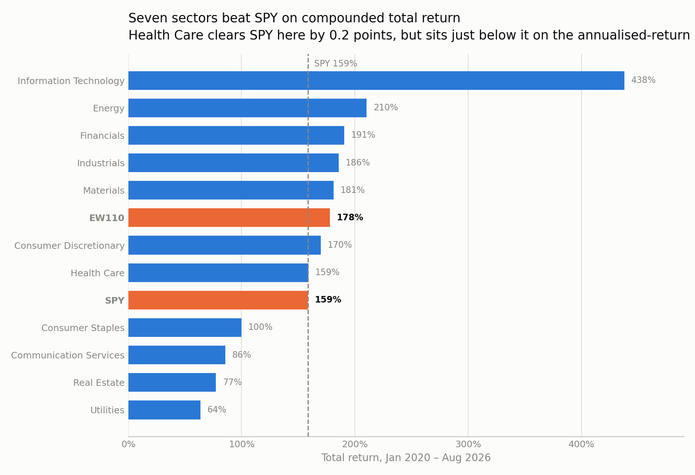
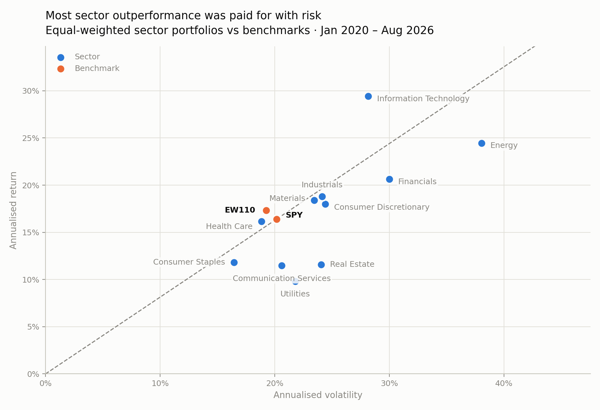
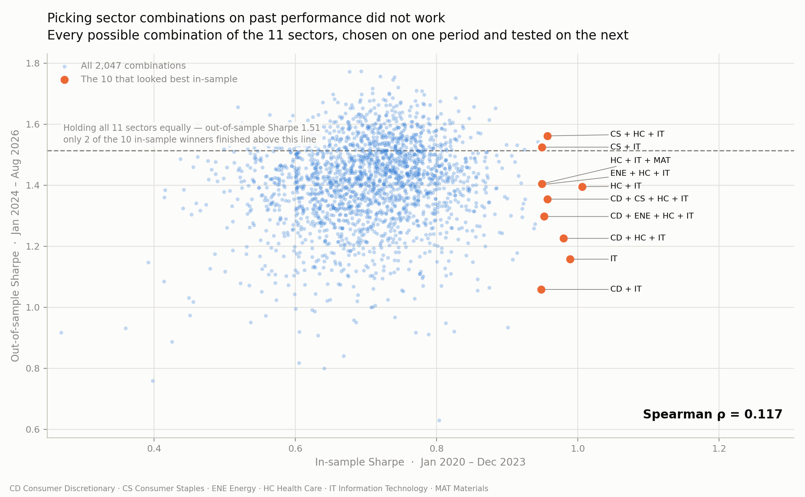
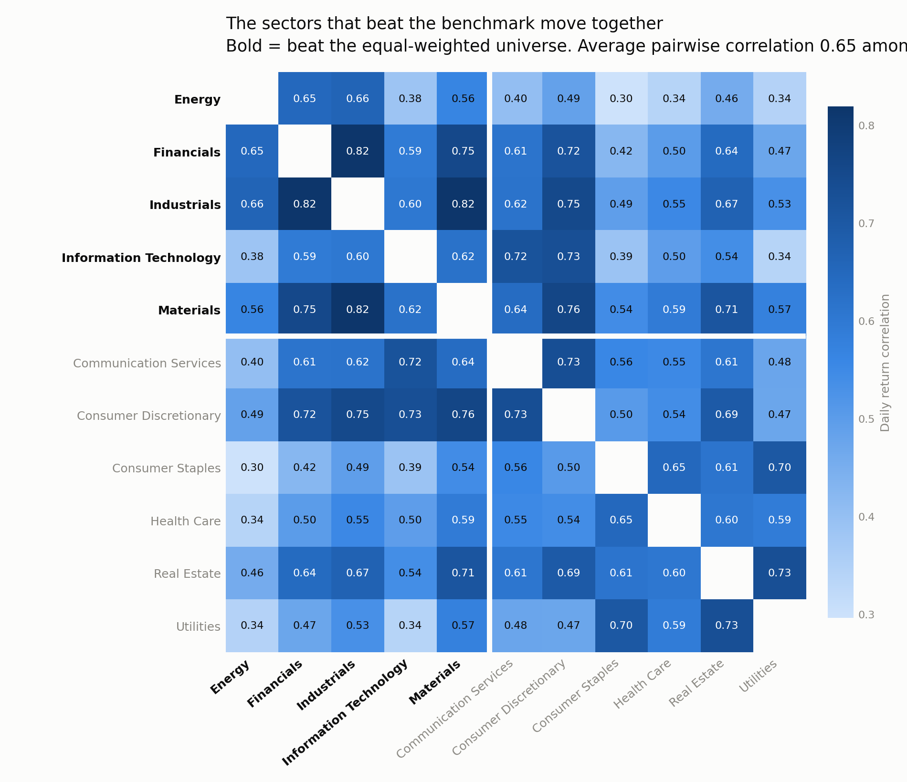

# Sector Performance and Risk-Adjusted Return

This project analyses a portfolio of stocks across different sectors with the aim of
determining whether the selected stocks across the sectors will outperform the market (SPY).

110 tickers, 11 GICS-style sectors, 10 tickers each, daily adjusted closes from
2020-01-02 to 2026-08-21 (183,480 rows), benchmarked against SPY.

---

## What I found

Seven sectors beat the benchmark SPY on total return, but only two beat it on Sharpe ratio.
Health Care is the borderline case: it beat SPY on compounded total return but sits marginally
below it on the chart's annualised-return axis, because SPY's higher volatility costs it more
when returns compound. Equal-weighting all 110 tickers beat SPY on both, which is why I used
EW110 as a second benchmark: SPY is cap-weighted across 500 tickers, while the sectors here are
equal-weighted baskets of 10.

Picking sectors on past performance did not hold up. The best combination from 2020 to 2023 —
Information Technology plus Health Care — finished 1,190th of 2,047 on 2024 to 2026. Technology,
the best sector in sample, finished 1,924th, in the bottom 6% out of sample.

---

## The analysis

### Total return by sector



Seven of the sectors beat SPY on total return. Health Care was almost identical to SPY.
Information Technology is an outlier with 438% total return. The EW110 benchmark at 178% sits
above SPY and all other sectors except five.

This is the compounded measure — what a holder would actually have ended up with.

### Risk and return by sector



The EW110 and SPY were the benchmarks. In this graph, it depicts the annualised return against
the annualised volatility. As you can see, all sectors that outperformed the benchmarks in
annualised returns had higher volatility. The price of their performance was risk. As you can
also see, the two sectors with lower risk also had lower returns. EW110 beat SPY on both Sharpe
and annualised return, and beat 10 of the 11 sectors on Sharpe, meaning it may be a lower risk,
higher return alternative to SPY.

The dashed line runs from the origin through SPY. Because Sharpe with a zero risk-free rate is
exactly annualised return divided by annualised volatility, that line *is* SPY's Sharpe ratio —
anything plotted above it beat SPY on risk-adjusted terms.

### Did the winners keep winning?



This depicts that the 10 best in the sample from January 2020 to December 2023 did not hold up
as the best from January 2024 to August 2026. Only two of the 10 sample winners finished above
the line.

The Spearman rank correlation between in-sample and out-of-sample Sharpe across all 2,047
combinations is 0.117 — close to no relationship at all. The median out-of-sample rank of the
in-sample top ten was 1,296 of 2,047, worse than the 1,024 a random pick would average.

Every one of the ten contained Information Technology. They were not ten different bets — they
were one bet on the sector that happened to run during the selection window, with various other
sectors along for the ride.

| In-sample rank | Combination | In-sample Sharpe | Out-of-sample Sharpe | Out-of-sample rank |
|---|---|---|---|---|
| 1 | Health Care + Information Technology | 1.006 | 1.395 | 1,190 |
| 2 | Information Technology | 0.989 | 1.157 | 1,924 |
| 3 | Consumer Discretionary + Health Care + Information Technology | 0.980 | 1.226 | 1,828 |
| 4 | Consumer Staples + Health Care + Information Technology | 0.957 | 1.562 | 239 |
| 5 | Consumer Discretionary + Consumer Staples + Health Care + Information Technology | 0.957 | 1.354 | 1,401 |
| 6 | Consumer Discretionary + Energy + Health Care + Information Technology | 0.952 | 1.297 | 1,642 |
| 7 | Energy + Health Care + Information Technology | 0.949 | 1.402 | 1,154 |
| 8 | Health Care + Information Technology + Materials | 0.949 | 1.404 | 1,136 |
| 9 | Consumer Staples + Information Technology | 0.949 | 1.525 | 394 |
| 10 | Consumer Discretionary + Information Technology | 0.948 | 1.058 | 2,005 |

### How correlated are the winners?



This shows the correlation between different sectors. It is evident that sectors that affect each
other move together, as depicted by the higher correlation index where they intersect in this
matrix. IT, which is the least correlated of the 5 winners, failed the hardest out of sample.

Average pairwise correlation is 0.646 among the sectors that beat EW110, against 0.578 across all
eleven — so a basket of past winners is less diversified than a random basket. Financials,
Industrials and Materials correlate at 0.82 / 0.82 / 0.75 with each other: three names for what
is effectively one cyclical bet.

---

## Method

The aim was to determine which sectors are outperforming the benchmark SPY. The Sharpe ratio is
used to determine whether the cost of a sector's outperformance is higher volatility, i.e. risk.
The portfolio was rebalanced to equal weight to keep the analysis fair. I ran a series of
combinations of sectors to see which combination had the best return. To test whether those
combinations held up, a sample of returns from 2020 to 2023 was used to select the highest
performers, and I then tested whether those performers held to the same standard from 2024 to
2026.

Assumptions worth stating explicitly:

| Choice | What it means |
|---|---|
| Equal-weighted sectors | Each sector portfolio averages its 10 constituents' daily returns, which implies rebalancing back to equal weight **every day** — not buy-and-hold. |
| `ddof=0` | Population standard deviation throughout, matching `STDEV.P`. The sample version would shift every Sharpe slightly. |
| Zero risk-free rate | Sharpe is computed with rf = 0. Fine for ranking sectors against each other; it overstates absolute risk-adjusted performance given cash rates over this window. |
| `sqrt(252)` | Annualisation factor — 252 trading days per year. |
| Two benchmarks | SPY is cap-weighted across 500 names; EW110 is the equal-weighted portfolio of all 110 tickers. Comparing an equal-weighted basket of 10 against SPY alone conflates sector selection with the equal-weighting effect. |
| 2020–2023 / 2024–2026 split | Combinations are *chosen* on the first period and *measured* on the second. Over any single fixed window some combination always beats the benchmark; the split is what separates a real result from a search. |

---

## Data quality decisions

The original data set contained EA and EQR. EA was delisted and EQR had data gaps. The decision
was made to replace them with industry peers. I added a null guard to protect against nulls
skewing the results. The unknown null fields caused a problem in my earlier attempt at this
project, which led me to take this measure.

Specifics:

- **EA** (Electronic Arts) was taken private and delisted from NASDAQ on 2026-08-04. Yahoo Finance
  did not merely stop updating it — the history was purged, leaving 6 usable rows out of 1,668.
  Truncating the date range does not recover it. Replaced with **TTWO** (Take-Two Interactive).
- **EQR** (Equity Residential) had 12 missing prices between 2026-07-23 and 2026-08-21,
  interleaved with valid days rather than sitting in a trailing block, plus stale repeated closes
  in the same window. Replaced with **MAA** (Mid-America Apartment Communities).
- One rule was applied to both: a constituent whose data is unusable is replaced by a
  same-industry peer. The cost of that rule is that choosing a replacement in 2026 for a universe
  defined in 2020 introduces look-ahead bias.
- **The null guard** proves that no null price sits *interior* to a ticker's series before any
  null is dropped. This matters because dropping an interior gap would splice two non-adjacent
  trading days together, and `pct_change()` would then report a multi-day move as a single day's
  return. The pipeline stops rather than silently producing wrong returns.

Repeated closing prices were also checked across the full history and run at 0.29%–0.42% of rows
per year, flat from 2020 to 2026 — ordinary background noise in the source, not contamination.

---

## Limitations

Two limitations. The first is the anomalous activity from 2020 to 2022 due to the pandemic market
pullback — however, markets will always have some type of unusual activity over any time period
chosen. The second is selection bias in the universe: the 10 tickers in each sector were chosen
partly because of popularity, so one could say they are close to the top performers in each of
those given sectors. The selection bias on the tickers I believe skewed the results higher than a
random sample of tickers.

A third, methodological: the out-of-sample test uses a **single split point**. A stronger version
would repeat it across rolling windows.

---

## What's in this repo

| Path | What it is |
|---|---|
| `notebooks/data_collection.ipynb` | Downloads prices from Yahoo Finance, reshapes to long format, computes daily returns, builds and loads the SQLite database, runs structural checks |
| `notebooks/analysis.ipynb` | The analysis: sector performance, the 2,047-combination out-of-sample test, correlation, and the three figures |
| `sql/schema.sql` | Table definitions and two base views |
| `sql/analysis.sql` | Monthly return, monthly volatility and sector overview views |
| `data/stock_data.csv` | Long-format price and daily return data, all 110 tickers |
| `data/benchmark_data.csv` | SPY price and daily return |
| `data/stock_data.db` | SQLite database — 4 tables, 5 views, populated |
| `reports/figures/` | The three figures used above |
| `dashboard/tableau_migration_notes.md` | Measure logic for a planned Tableau build |

### Database schema

```
sector_dim(Date, Ticker PK, Sector)
stock_data(Date, Ticker, Sector, Adj_Close, Daily_return)        PK (Date, Ticker)
benchmark_data(Date, Ticker, Sector, Adj_Close, Benchmark_return) PK (Date, Ticker)
cash_flows(Flow_ID PK, Date, CashFlow)

views:
  vw_benchmark_returns    recomputes benchmark return from price
  vw_daily_returns        stock returns joined to the benchmark by date
  vw_monthly_returns      compounded monthly return per ticker
  vw_monthly_volatility   std dev of daily returns per ticker per month
  vw_portfolio_overview   equal-weighted average daily return per sector
```

---

## Reproducing this

Requires Python 3.9 or later.

```bash
git clone https://github.com/jasonpwyatt88/portfolio-analysis.git
cd portfolio-analysis
python3 -m venv .venv && source .venv/bin/activate
pip install -r requirements.txt
```

Then run `notebooks/data_collection.ipynb` top to bottom, followed by
`notebooks/analysis.ipynb`. The collection notebook rebuilds `data/` from scratch — delete the
three files in `data/` first if you want to prove it.

The collection notebook ends in a set of assertions rather than printed output: every ticker
present, every ticker with the same number of trading days, zero null prices, exactly one null
return per ticker (each ticker's first day, which has no prior close), the benchmark covering the
same trading calendar, dates stored as `YYYY-MM-DD`, and all five views built. If any of those
fail the pipeline stops.

**Re-running will not reproduce the exact figures quoted above.** The notebook pulls live data
from Yahoo Finance, so a later run includes later trading days and the numbers move. The figures
in this README are as of 2026-08-21.

---

## Planned extensions

- Rebuild the dashboard in Tableau Public — measure logic is mapped in
  `dashboard/tableau_migration_notes.md`. An earlier Power BI version was removed because it was
  built on the pre-replacement universe and its figures no longer match the data.
- Repeat the out-of-sample test across rolling windows rather than one split.
- Extend into money-weighted return using the `cash_flows` table, which is currently unused.
